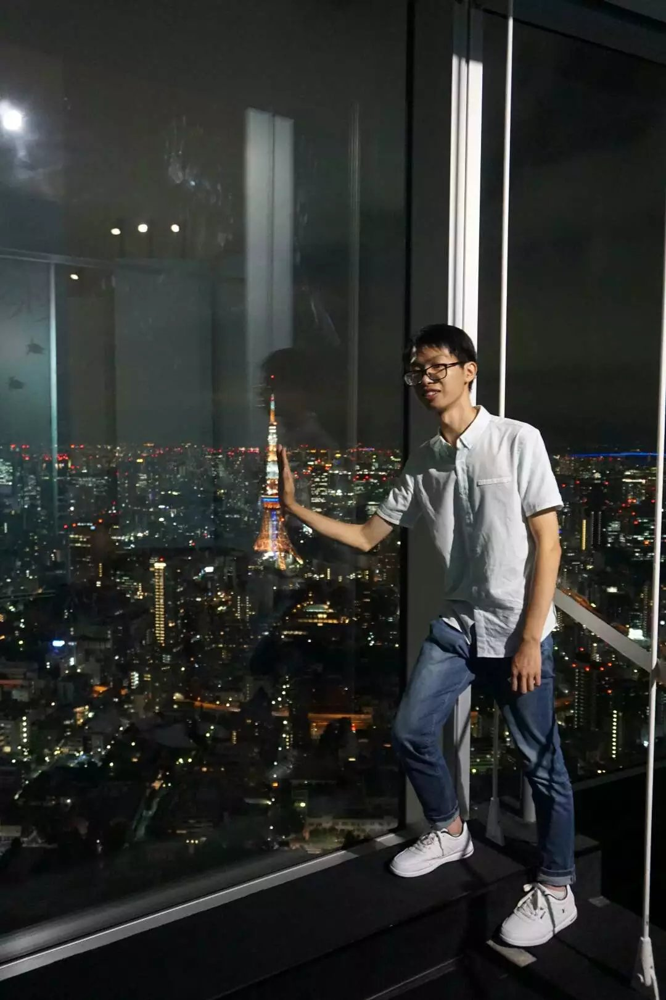

## Welcome to my homepage

### Info
I am a master student of the second grade at the National Institute of Infomatics, Japan. Currently I 
am exploring how to control the generation of sentences, including image captions, etc.,
under the supervision of Prof. Yusuke Miyao.  

### Education
- 2013 ~ 2017: Bachelor degree at University of Science and Technology of China
- 2017 ~ 2019: Master degree at National Institue of Informatics, Tokyo, Japan

### Experience
- 2017 ~ 2018: Research assistant at National Institute of Informatics
- 2018 ~ 2019: Technical assistant at The University of Tokyo
- 2018 ~ 2019: Special research student at The University of Tokyo

### Research Interest
- Computer Vision and Natural Language Processing
- Reinforcement Learning
- Semi-supervised Learning

